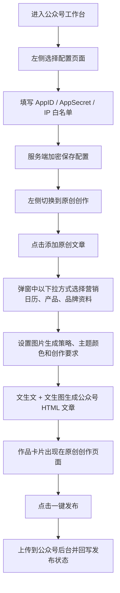

## 1. 产品概述

公众号板块用于把品牌已有内容资产快速整理为微信公众号文章草稿，并通过最安全的发布链路送入公众号草稿箱。

* 面向品牌运营、内容编辑、门店市场人员，解决“内容整理分散、素材植入重复、公众号发布配置复杂”的问题

* 产品价值是把品牌信息、产品信息、营销日历与文章生成、排版、草稿发布整合到一个工作台中

## 2. 核心功能

### 2.1 用户角色

| 角色    | 进入方式    | 核心权限                   |
| ----- | ------- | ---------------------- |
| 品牌管理员 | 登录品牌工作台 | 配置公众号账号、查看发布结果、管理默认模板  |
| 内容运营  | 登录品牌工作台 | 新建文章、选择植入内容、生成草稿、提交草稿箱 |

### 2.2 功能模块

1. **配置页面**：单独配置公众号 `AppID`、`AppSecret` 和 IP 白名单，敏感字段仅服务端保存
2. **原创创作页面**：通过“添加原创文章”弹窗选择营销日历、产品信息、品牌资料、图片生成策略和主题颜色，生成公众号原创文章
3. **作品卡片区**：按类似小红书作品区的方式展示已生成文章，并提供“一键发布”动作
4. **技能中心映射**：将“创作文章”“制作图片”同步到前后端技能中心，分别对应文生文与文生图模型能力

### 2.3 页面明细

| 页面名称    | 模块名称   | 功能描述 |
| --------- | ------- | ------------------------------------------ |
| 配置页面 | 公众号凭证配置 | 显示并保存 `AppID`、`AppSecret`，`AppSecret` 在前端只以掩码占位回显 |
| 配置页面 | IP 白名单配置 | 以多行输入形式维护微信公众平台要求的服务端出口 IP 白名单 |
| 配置页面 | 配置保存区 | 保存公众号凭证、默认主题色等配置，供原创创作页直接复用 |
| 原创创作页面 | 添加原创文章弹窗 | 点击“添加原创文章”后打开弹窗，使用下拉框选择营销日历、产品信息、品牌资料 |
| 原创创作页面 | 创作参数区 | 在弹窗内配置图片生成策略、主题颜色、创作要求，固定输出 HTML |
| 原创创作页面 | 作品卡片区 | 像小红书作品区一样展示已生成文章卡片、状态、主题色和来源信息 |
| 原创创作页面 | 一键发布动作 | 点击“一键发布”后，文章上传到公众号后台，并更新作品卡片状态 |
| 技能中心 | 公众号技能项 | 展示“公众号创作文章”“公众号制作图片”两项，并可独立配置模型与提示词 |

## 3. 核心流程

核心流程分为“账号配置”和“原创创作发布”两条主线。账号配置由品牌管理员完成，优先使用官方 API 的服务端调用方式；内容运营在原创创作页通过弹窗选择营销日历、产品信息、品牌资料、图片生成策略和主题颜色，系统生成公众号友好的 HTML 文章，最终通过“一键发布”上传到公众号后台。

## 4. 用户界面设计

### 4.1 设计风格

* 主色：墨绿、米白、深炭灰，突出“品牌编辑台”气质

* 辅色：金色用于安全状态和发布成功提示，浅青色用于植入信息卡

* 按钮风格：圆角中等、轻拟物阴影、重要动作使用实心按钮

* 字体：标题使用偏编辑感字体，正文使用高可读衬线或人文字体

* 布局：桌面优先，左侧为“配置页面 / 原创创作”分栏，右侧为对应工作区内容

* 图标建议：使用编辑、盾牌、草稿箱、日历、产品卡片、品牌徽章等简洁线性图标

### 4.2 页面设计概览

| 页面名称 | 模块名称 | UI 元素 |
| --------- | ------ | ------------------------------------- |
| 配置页面 | 左侧分栏入口 | “配置页面”“原创创作”两个分栏按钮，与其他板块工作区保持一致 |
| 配置页面 | 凭证卡 | `AppID`、`AppSecret` 输入框与保存按钮 |
| 配置页面 | 白名单卡 | 多行 `IP 白名单` 输入框、提示文案 |
| 原创创作页面 | 头部操作栏 | “刷新数据”“添加原创文章”按钮 |
| 原创创作页面 | 添加原创文章弹窗 | 营销日历下拉、产品下拉、品牌资料是/否下拉、图片策略下拉、主题色、创作要求 |
| 原创创作页面 | 作品卡片区 | 封面色块、标题、摘要、来源标签、状态标签、一键发布按钮 |
| 原创创作页面 | HTML 查看动作 | 支持查看生成后的 HTML 成品 |
| 技能中心 | 能力映射卡 | 标注公众号创作文章走第三方文生文，公众号制作图片走第三方文生图 |

### 4.3 响应式设计

* 采用桌面优先布局，适配 1280px 以上主工作台场景

* 1120px 以下切为上下结构，先显示左侧分栏，再显示配置页或原创创作页主体

* 所有敏感配置卡片在移动端保持单列展示，避免误触和信息遮挡
