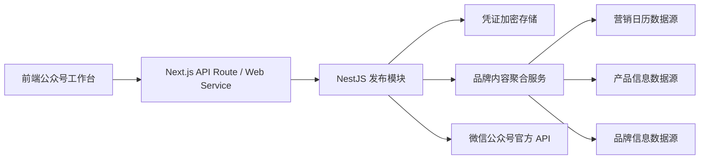
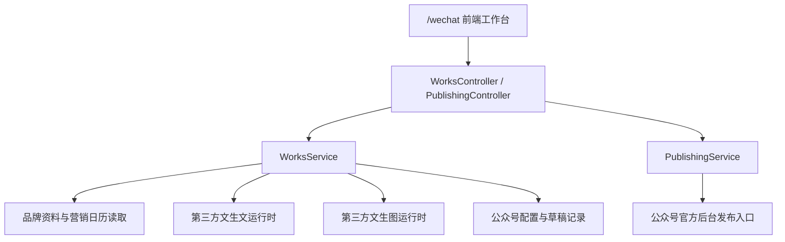
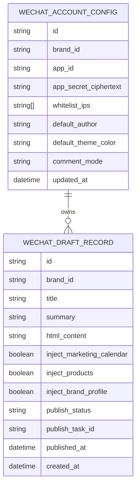

## 1. 架构设计



## 2. 技术说明

* 前端：Next.js App Router + TypeScript + 现有工作台样式体系

* 后端：NestJS 模块化接口 + 现有品牌上下文鉴权

* 数据层：复用当前品牌配置与作品存储体系，新增公众号账号配置与草稿记录

* 外部服务：微信公众号官方 API

* 安全策略：默认只开放服务端 API 模式，不在前端直接调用微信接口，不把 `AppSecret` 下发到浏览器

## 3. 路由定义

| 路由                         | 用途                                 |
| -------------------------- | ---------------------------------- |
| `/wechat`                  | 公众号工作台正式入口，左侧包含“配置页面 / 原创创作”两个分栏   |
| `/wechat?section=config`   | 配置页面，维护 `AppID`、`AppSecret`、IP 白名单 |
| `/wechat?section=original` | 原创创作页面，展示作品卡片与发布动作                 |
| `/wechat?modal=create`     | 添加原创文章弹窗                           |

## 4.4 技能中心映射

| 技能名称    | slug                      | 对应能力                 | 第三方运行时                            |
| ------- | ------------------------- | -------------------- | --------------------------------- |
| 公众号创作文章 | `wechat-article-composer` | 生成固定 HTML 结构的公众号文章草稿 | `text-global` / `text-domestic-*` |
| 公众号制作图片 | `wechat-image-designer`   | 生成公众号头图、封面图和文中配图     | `image-generation`                |

## 4. API 定义

### 4.1 配置接口

```ts
type SaveWechatAccountConfigPayload = {
  appId: string;
  appSecret: string;
  whitelistIps?: string[];
  defaultAuthor?: string;
  defaultThemeColor?: string;
  commentMode?: "open" | "fans" | "close";
};

type WechatAccountConfigRecord = {
  brandId: string;
  configured: boolean;
  appId: string;
  appSecretMasked: string;
  whitelistIps: string[];
  defaultAuthor?: string;
  defaultThemeColor?: string;
  commentMode: "open" | "fans" | "close";
  updatedAt: string;
};
```

### 4.2 内容聚合与植入接口

```ts
type GenerateWechatArticleDraftPayload = {
  title?: string;
  summary?: string;
  author?: string;
  content?: string;
  coverMode?: "ai" | "upload" | "asset";
  commentMode?: "open" | "fans" | "close";
  imageMode?: "cover-and-body" | "cover-only" | "body-only";
  themeColor?: string;
  injectMarketingCalendar?: boolean;
  injectProducts?: boolean;
  injectBrandProfile?: boolean;
  selectedMarketingLabels?: string[];
  selectedProductLabels?: string[];
  selectedBrandLabels?: string[];
};

type WechatArticleDraftRecord = {
  id: string;
  taskId: string;
  brandId: string;
  title: string;
  summary: string;
  author: string;
  content: string;
  htmlContent: string;
  outputFormat: "HTML";
  coverMode: "ai" | "upload" | "asset";
  commentMode: "open" | "fans" | "close";
  imageMode: "cover-and-body" | "cover-only" | "body-only";
  themeColor: string;
  injectMarketingCalendar: boolean;
  injectProducts: boolean;
  injectBrandProfile: boolean;
  selectedMarketingLabels: string[];
  selectedProductLabels: string[];
  selectedBrandLabels: string[];
  publishStatus: "DRAFT" | "PUBLISHED";
  publishedAt?: string;
  publishTaskId?: string;
};
```

### 4.3 草稿发布接口

```ts
type PublishWechatArticlePayload = {
  mode?: "PUBLISH_ARTICLE";
};

type PublishWechatArticleResponse = {
  task: {
    id: string;
    taskStatus: string;
    taskTitle: string;
  };
  item: WechatArticleDraftRecord;
};
```

## 5. 服务端架构图



## 6. 数据模型

### 6.1 数据模型定义



### 6.2 数据定义语言

```sql
create table wechat_account_configs (
  id text primary key,
  brand_id text not null,
  app_id text not null,
  app_secret_ciphertext text not null,
  whitelist_ips text[] not null default '{}',
  default_author text,
  default_theme_color text,
  comment_mode text not null default 'open',
  created_at timestamptz not null default now(),
  updated_at timestamptz not null default now()
);

create unique index wechat_account_configs_brand_id_key
  on wechat_account_configs (brand_id);

create table wechat_draft_records (
  id text primary key,
  brand_id text not null,
  title text not null,
  summary text not null,
  html_content text not null,
  inject_marketing_calendar boolean not null default false,
  inject_products boolean not null default false,
  inject_brand_profile boolean not null default false,
  publish_status text not null default 'DRAFT',
  publish_task_id text,
  published_at timestamptz,
  created_at timestamptz not null default now()
);

create index wechat_draft_records_brand_created_idx
  on wechat_draft_records (brand_id, created_at desc);
```

## 7. 安全与发布策略

* 默认采用 `api` 发布方式，对接微信公众号官方草稿接口；不在前端存储或拼接 `access_token`

* `AppID` 与 `AppSecret` 仅通过后端保存，`AppSecret` 必须加密存储，前端只展示掩码和最后校验状态

* 服务端出口 IP 需要提前加入微信公众平台白名单，配置页需支持品牌管理员维护白名单列表

* 前端只调用品牌内网接口，由服务端统一换取 `access_token` 并调用微信接口

* 第一阶段不默认启用浏览器自动化发布，避免登录态冲突、剪贴板权限、Chrome 配置泄露等风险

* 生成后的原创文章先以作品卡片形式展示，再通过“一键发布”上传到公众号后台，不直接群发

* 植入的营销日历、产品信息、品牌信息必须支持人工二次编辑与删除，避免错误内容直接进入草稿

* 创作文章能力默认接第三方文生文运行时，制作图片能力默认接第三方文生图运行时，并在前后端技能中心中保持同名映射

