# AI全域运营系统 Mermaid 全站关联地图

## 1. 文档目的

本文件是 `docs/site-map.md` 的可视化补充版本，专门用 Mermaid 把当前项目的前端板块、页面内部结构、前端服务层、后端 API 模块、数据模型和运行脚本串成一张可以快速总览的结构地图。

适用场景：

- 新人快速理解项目全貌
- 排查某个页面到底依赖了哪些 service、API 和数据表
- 评估新增功能应该挂在哪个板块和模块
- 后续持续维护“页面 -> service -> API -> schema”的全局索引

## 2. 阅读建议

- 先看“全站总图”，建立项目分层认知
- 再按业务看“品牌增长策略”和“小红书工作台”两张主链路图
- 然后看“后台/个人中心”与“后端模块/数据模型”图
- 需要落到代码时，再回到 `docs/site-map.md` 与对应文件

## 3. 全站总图

```mermaid
flowchart TD
    A["AI全域运营系统"]
    A --> B["apps/web 前端站点"]
    A --> C["apps/server 后端 API"]
    A --> D["prisma/schema.prisma 数据模型"]
    A --> E["docs 结构化文档"]
    A --> F["scripts 稳定启动/初始化脚本"]
    A --> G["部署与运行配置"]

    B --> B1["统一认证入口 /"]
    B --> B2["品牌增长策略 /brand-growth"]
    B --> B3["小红书工作台 /xiaohongshu"]
    B --> B4["个人中心 /personal-center"]
    B --> B5["后台管理 /admin"]
    B5 --> B51["接口供应商平台配置中心"]
    B51 --> B511["左侧平台列表 + 搜索 / 状态筛选 / 类型筛选"]
    B51 --> B512["右侧平台详情：链接 / 模型 ID / 默认模型 / 文档"]
    B51 --> B513["前台 Owner 另在个人中心维护私有 API Key"]
    B2 --> B21["每日热点：4:00 定时 + 缺失时工作区自动补抓"]
    B --> B6["兼容认证页 /login /register（注册含邀请码）"]
    B --> B7["会员/点数/订单"]
    B --> B8["移动发布 /publish/mobile/[token]"]
    B --> B9["共享浅底导航壳"]
    B9 --> B91["前台顶部导航（仅保留横向主导航）"]
    B9 --> B92["前台左侧目录导航（仅保留按钮本体）"]
    B9 --> B93["后台目录导航"]

    C --> C1["AuthModule 登录/注册/邀请码"]
    C --> C2["BrandsModule"]
    C --> C3["CollectorsModule"]
    C --> C4["ReportsModule"]
    C --> C5["WorksModule"]
    C --> C6["PublishingModule"]
    C --> C7["TasksModule"]
    C --> C8["MediaModule"]
    C --> C9["OrdersModule"]
    C --> C10["Admin 模块组"]
    C10 --> C101["ApiProvidersModule 运行时 Provider 真源"]

    D --> D1["用户与订单域"]
    D --> D2["品牌资料域"]
    D --> D3["采集资产域"]
    D --> D4["任务域"]
    D --> D5["媒体资产域"]
    D --> D6["飞书授权域"]
    D --> D7["技能/提示词注册域"]

    E --> E1["site-map.md 文字地图"]
    E --> E2["site-map-mermaid.md Mermaid 地图"]
    E --> E3["engineering-standards.md"]
    E --> E4["changes/*.md"]
    E --> E5["database-archive.md"]

    F --> F1["dev:web:stable"]
    F --> F2["dev:server:stable"]
    F --> F3["seed-demo.cjs"]
    F1 --> F11["api/[...path]/route.ts 同域代理到 3011/api"]

    G --> G1[".github/workflows/deploy.yml"]
    G --> G2["ecosystem.config.cjs"]
    G2 --> G21["ai-omni-web -> 127.0.0.1:3001"]
    G2 --> G22["ai-omni-server -> 127.0.0.1:3011"]
    G1 --> G3["部署前检查服务器工作区干净"]
    G1 --> G4["部署后校验本机端口与健康检查"]
```

## 4. 前端路由地图

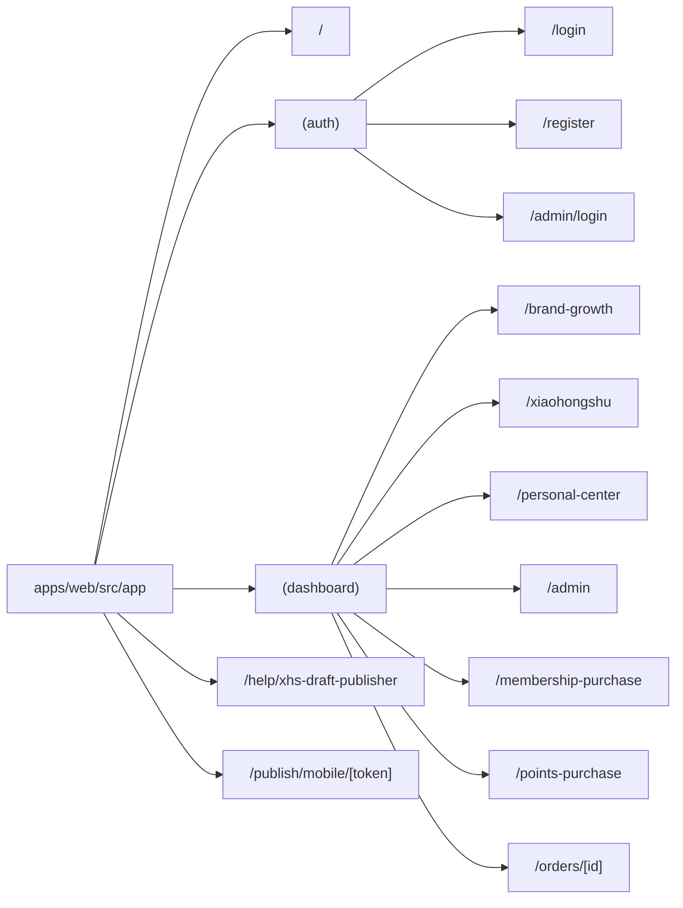

## 5. 品牌增长策略板块深度地图

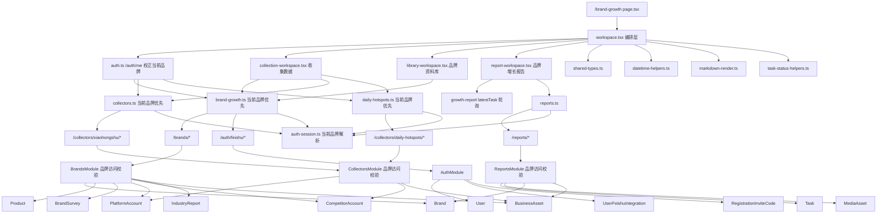

### 5.1 品牌增长策略内部页面颗粒度

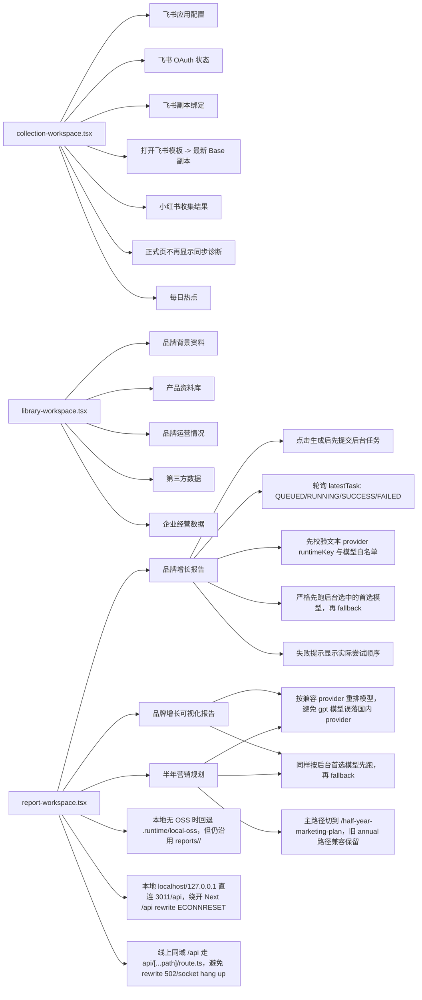

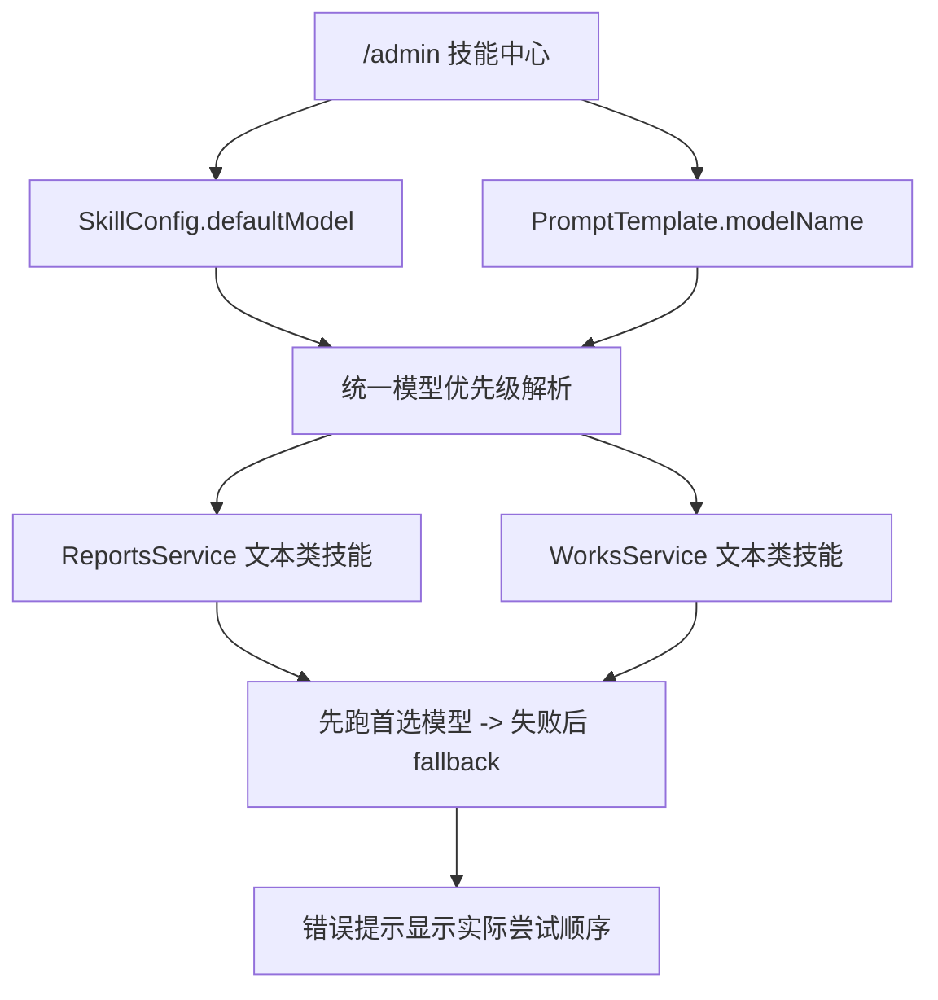

## 6. 小红书工作台深度地图

```mermaid
flowchart TD
    XHS["/xiaohongshu page.tsx"]
    XHS --> XA["auth.ts /auth/me 校正当前品牌"]

    XHS --> HX1["AssetsWorkspace 素材库"]
    XHS --> HX2["PlanWorkspace 营销策划方案"]
    XHS --> HX3["CalendarWorkspace 营销日历"]
    XHS --> HX4["OriginalWorkspace 原创笔记"]
    XHS --> HX5["RewriteWorkspace 二创笔记"]
    XHS --> HX6["VideoWorkspace 视频笔记"]
    XHS --> HX7["PublishModal 发布弹窗"]
    XHS --> HX8["MediaLightbox 媒体灯箱"]
    HX1 --> HX11["飞书代理资源：鉴权 fetch blob -> object URL"]

    XHS --> HK1["useNoteComposerForms"]
    XHS --> HK2["usePublishFlow"]
    XHS --> HK3["useWorkComposerActions"]
    XHS --> HK4["useWorkEditors"]
    XHS --> HK5["useWorkMutationActions"]
    XHS --> HK6["useWorkspaceSelectionSync"]
    XHS --> HK7["task-polling.ts"]

    HX4 --> HX41["note-create-modals.tsx"]
    HX4 --> HX42["note-edit-modals.tsx"]
    HX4 --> HX43["work-card-grids.tsx"]
    HX4 --> HX44["original-reference-template-picker.tsx"]
    HX5 --> HX41
    HX5 --> HX42
    HX5 --> HX43
    HX6 --> HX41
    HX6 --> HX42
    HX6 --> HX43

    XHS --> HH1["calendar-helpers.ts"]
    XHS --> HH2["datetime-helpers.ts"]
    XHS --> HH3["markdown-render.ts"]
    XHS --> HH4["preview-builders.ts"]
    XHS --> HH5["publish-status-helpers.ts"]
    XHS --> HH6["task-status-text-helpers.ts"]
    XHS --> HH7["work-media-helpers.ts"]
    XHS --> HH8["work-task-helpers.ts"]
    XHS --> HH9["desktop-publish-bridge.ts"]
    XHS --> HH10["shared-types.ts"]
    XHS --> HH11["publish-types.ts"]

    HK1 --> SX1["xiaohongshu.ts"]
    HK2 --> SX2["publishing.ts"]
    HK3 --> SX3["works.ts"]
    HK5 --> SX3
    HX1 --> SX4["collectors.ts"]
    HX1 --> HH7["work-media-helpers.ts"]
    HX2 --> SX5["reports.ts"]
    HX3 --> SX5
    XHS --> SX0["auth-session.ts 本地品牌缓存"]
    XA --> SX0
    XA --> SX1
    XA --> SX3
    XA --> SX4
    XA --> SX5

    SX1 --> AX1["/brands/* + /reports/* + /collectors/* 聚合读取"]
    SX2 --> AX2["/publishing/xiaohongshu/*"]
    SX3 --> AX3["/works/brands/:brandId/xiaohongshu/*"]
    SX3 --> AX31["/works/brands/:brandId/xiaohongshu/video/providers"]
    SX3 --> AX32["/works/xiaohongshu/original/reference-templates*"]
    SX4 --> AX4["/collectors/xiaohongshu/*"]
    HH7 --> AX41["/collectors/xiaohongshu/brands/:brandId/feishu-media"]
    SX5 --> AX5["/reports/brands/:brandId/xiaohongshu-*"]
    SX0 --> SX1
    SX0 --> SX3
    SX0 --> SX4
    SX0 --> SX5

    AX2 --> MX1["PublishingModule"]
    AX3 --> MX2["WorksModule"]
    AX31 --> MX2
    AX32 --> MX2
    AX4 --> MX3["CollectorsModule 品牌访问校验"]
    AX41 --> MX3
    AX5 --> MX4["ReportsModule 品牌访问校验"]

    MX1 --> TX1["Task"]
    MX1 --> TX2["MediaAsset"]
    MX2 --> TX1
    MX2 --> TX2
    MX2 --> TX3["Brand"]
    MX2 --> TX4["Product"]
    MX2 --> TX8["ApiProvidersModule runtimeKey 读取"]
    MX3 --> TX5["PlatformAccount"]
    MX3 --> TX6["CompetitorAccount"]
    MX3 --> TX7["BusinessAsset"]
    MX4 --> TX1
    MX4 --> TX2
```

### 6.1 小红书工作台内部页面颗粒度

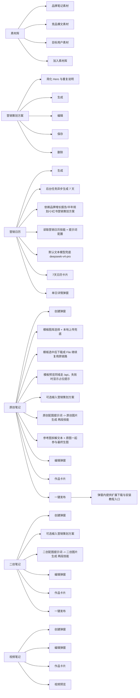

## 7. 个人中心、支付和后台管理地图

```mermaid
flowchart TD
    PC["/personal-center"]
    PC --> PCS1["personal-center.ts"]
    PC --> PC1["/personal-center/orders"]
    PC --> PC2["/personal-center/works"]
    PC --> PC3["/personal-center/skills 用户技能覆盖编辑器"]
    PC --> PC31["/personal-center/third-party-platforms 平台基线 + 私有 Key + 权限控制"]
    PC --> PC4["/personal-center/security 头像上传到 OSS"]
    PC --> PC5["/personal-center/tasks"]
    PC --> PC6["/personal-center/team 三角色 + 权限矩阵"]
    PC --> PC7["/personal-center/invites"]
    PCS1 --> PAPI1["/auth/profile 读写"]
    PC4 --> PAPI11["/auth/profile/avatar + /auth/users/:userId/avatar/:fileName"]
    PCS1 --> PAPI2["/auth/point-ledgers"]
    PCS1 --> PAPI3["/orders"]
    PCS1 --> PAPI4["/tasks"]
    PCS1 --> PAPI5["/media"]
    PC3 --> PAPI6["/user-skills 读取/保存/重置（旧表缺列自动补齐，旧图片默认模型安全回填到 Right Codes）"]
    PC3 --> PAPI62["/user-skills/editor-options 返回 Provider 作用域模型选项"]
    PC31 --> PAPI61["/third-party-platforms 按板块权限读取 / 保存私有 Key"]
    PAPI1 --> PM1["AuthModule"]
    PAPI11 --> PM1
    PAPI2 --> PM1
    PAPI3 --> PM2["OrdersModule"]
    PAPI6 --> PM6["UserSkillsModule"]
    PAPI61 --> PM61["ThirdPartyPlatformsModule"]
    PAPI4 --> PM3["TasksModule"]
    PAPI5 --> PM4["MediaModule"]

    Pay["/membership-purchase + /points-purchase + /orders/[id]"]
    Pay --> PCS1

    Admin["/admin"]
    Admin --> AS1["admin.ts"]
    Admin --> AS2["users-management-panel.tsx"]
    Admin --> AUI1["仪表盘"]
    Admin --> AUI2["订单管理"]
    Admin --> AUI3["会员与积分规则"]
    Admin --> AUI4["用户管理"]
    AUI4 --> AUI41["筛选区：关键词/会员/状态/角色/邮箱验证"]
    AUI4 --> AUI42["列表区：普通用户 + 管理员账号"]
    AUI4 --> AUI43["弹窗详情编辑：邮箱/电话/密码/会员/积分/角色"]
    AUI4 --> AUI44["删除动作：确认弹窗后删除账号"]
    Admin --> AUI5["模型消耗"]
    Admin --> AUI6["技能中心"]
    Admin --> AUI7["知识库管理"]
    Admin --> AUI8["接口供应商（按平台分组）"]
    AUI8 --> AUI81["左侧：平台列表 + 搜索/状态/类型筛选"]
    AUI8 --> AUI82["右侧：平台链接 / 文档 / 模型 ID / 默认模型 / 备注"]
    AUI8 --> AUI83["后台不填 API Key；前台 Owner 单独维护私有 Key"]
    AUI6 --> AUI61["左侧一级分类：点击后展开"]
    AUI61 --> AUI611["品牌增长策略 / 小红书 / 抖音"]
    AUI6 --> AUI62["左侧二级分类：业务模块"]
    AUI6 --> AUI63["左侧三级分类：具体技能项"]
    AUI63 --> AUI631["原创笔记-原创文案 / 原创笔记-原创配图"]
    AUI63 --> AUI6311["原创笔记-图片生成"]
    AUI63 --> AUI632["二创笔记-二创文案 / 二创笔记-二创配图"]
    AUI63 --> AUI6321["二创笔记-图片生成"]
    AUI63 --> AUI633["视频笔记-视频创作"]
    AUI63 --> AUI634["营销日历-生成7天营销日历"]
    AUI6 --> AUI65["左侧目录式技能导航"]
    AUI6 --> AUI64["中间单技能精简卡"]
    AUI64 --> AUI641["技能名称 / 状态 / 默认模型"]
    AUI64 --> AUI642["点数成本 / 更新时间"]
    AUI64 --> AUI643["技能提示词 / 保存技能"]
    AUI643 --> AUI6431["自动聚合真实 SKILL.md + 同目录参考资料"]
    AUI643 --> AUI6432["数据库优先：SkillConfig / PromptTemplate"]
    AUI643 --> AUI6433["聚合型提示词当前只读展示，需回原始目录维护"]
    Admin --> AUI9["左侧浅底目录导航"]
    AS1 --> AAPI1["/orders/admin/list"]
    AS1 --> AAPI2["/admin/billing-rules"]
    AS1 --> AAPI3["/admin/users"]
    AS1 --> AAPI31["/admin/users/:id"]
    AS1 --> AAPI32["DELETE /admin/users/:id"]
    AS1 --> AAPI4["/admin/model-usage"]
    AS1 --> AAPI5["/admin/skills"]
    AS1 --> AAPI6["/admin/prompts"]
    AS1 --> AAPI7["/admin/knowledge-bases"]
    AS1 --> AAPI8["/admin/knowledge-base-files"]
    AS1 --> AAPI9["/admin/third-party-platforms"]
    AS1 --> AAPI91["ApiProviderConfig 含 Right Codes 文生文/文生图种子"]
```

## 8. 前端 service 到后端 API 关系图

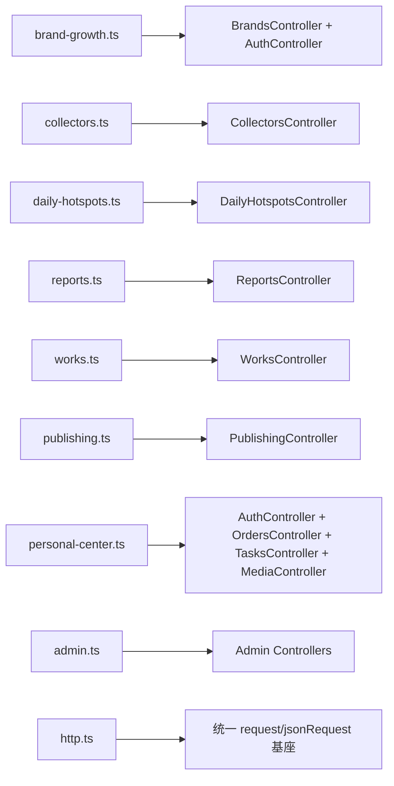

## 9. 后端模块关系图

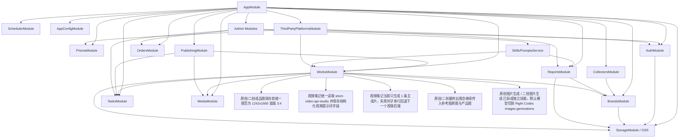

## 10. 核心数据模型关系图

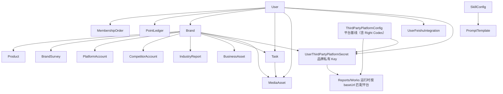

## 11. 运行与维护地图

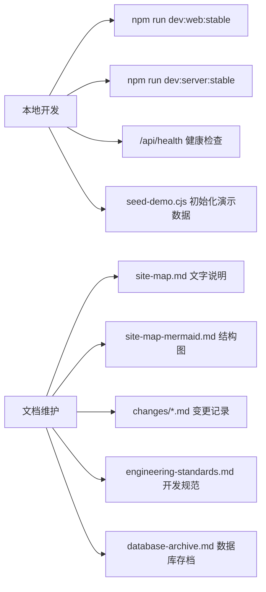

## 12. 维护规则

- 新增页面、工作区、hook、service、controller 或数据模型时，优先更新本文件
- 如果结构没有变化，只是实现细节变化，可以只更新 `docs/changes/*.md`
- 如果主链路发生变化，应同时更新 `docs/site-map.md` 和本文件
- Mermaid 图应保持“页面 -> service -> API -> 模块 -> 数据模型”的可追踪关系，不只列名称

## 13. 代码定位索引

本节用于把“结构图节点”直接映射到真实代码入口，便于从全局图快速跳到实现。

### 13.1 前端页面入口索引

- 首页：`apps/web/src/app/page.tsx`
- 登录页：`apps/web/src/app/(auth)/login/page.tsx`
- 注册页：`apps/web/src/app/(auth)/register/page.tsx`（真实注册表单 + 邀请码）
- 扩展帮助页：`apps/web/src/app/help/xhs-draft-publisher/page.tsx`
- 品牌增长策略：`apps/web/src/app/(dashboard)/brand-growth/page.tsx`
- 当前 `brand-growth/workspace.tsx` 已改为读取团队权限模板；无品牌增长策略 `view` 权限时不再继续渲染策略操作面板
- 小红书工作台：`apps/web/src/app/(dashboard)/xiaohongshu/page.tsx`
- 个人中心：`apps/web/src/app/(dashboard)/personal-center/page.tsx`
- 个人中心订单中心：`apps/web/src/app/(dashboard)/personal-center/orders/page.tsx`
- 个人中心作品中心：`apps/web/src/app/(dashboard)/personal-center/works/page.tsx`
- 个人中心技能中心：`apps/web/src/app/(dashboard)/personal-center/skills/page.tsx`
- 个人中心第三方接口配置：`apps/web/src/app/(dashboard)/personal-center/third-party-platforms/page.tsx`
- 个人中心安全设置：`apps/web/src/app/(dashboard)/personal-center/security/page.tsx`（账号资料编辑 + 会话安全）
- 个人中心任务中心：`apps/web/src/app/(dashboard)/personal-center/tasks/page.tsx`
- 个人中心团队协作：`apps/web/src/app/(dashboard)/personal-center/team/page.tsx`
- 当前团队协作页已统一为 `管理员 / 员工 / 达人` 三角色，并新增员工/达人权限矩阵区块
- 个人中心邀请通知：`apps/web/src/app/(dashboard)/personal-center/invites/page.tsx`
- 后台管理：`apps/web/src/app/(dashboard)/admin/page.tsx`
- 后台用户管理面板：`apps/web/src/app/(dashboard)/admin/users-management-panel.tsx`
- 会员购买：`apps/web/src/app/(dashboard)/membership-purchase/page.tsx`
- 点数购买：`apps/web/src/app/(dashboard)/points-purchase/page.tsx`
- 订单详情：`apps/web/src/app/(dashboard)/orders/[id]/page.tsx`
- 移动发布承接页：`apps/web/src/app/publish/mobile/[token]/page.tsx`

### 13.2 品牌增长策略代码入口索引

- 页面编排入口：`apps/web/src/app/(dashboard)/brand-growth/workspace.tsx`
- 收集数据工作区：`apps/web/src/app/(dashboard)/brand-growth/collection-workspace.tsx`
- 品牌资料库工作区：`apps/web/src/app/(dashboard)/brand-growth/library-workspace.tsx`
- 报告工作区：`apps/web/src/app/(dashboard)/brand-growth/report-workspace.tsx`
- 共享类型：`apps/web/src/app/(dashboard)/brand-growth/shared-types.ts`
- 时间/排序 helper：`apps/web/src/app/(dashboard)/brand-growth/datetime-helpers.ts`
- Markdown/预览 helper：`apps/web/src/app/(dashboard)/brand-growth/markdown-render.ts`
- 状态文案 helper：`apps/web/src/app/(dashboard)/brand-growth/task-status-helpers.ts`

### 13.3 小红书工作台代码入口索引

- 页面编排入口：`apps/web/src/app/(dashboard)/xiaohongshu/page.tsx`
- 素材库工作区：`apps/web/src/app/(dashboard)/xiaohongshu/assets-workspace.tsx`
- 营销策划方案工作区：`apps/web/src/app/(dashboard)/xiaohongshu/plan-workspace.tsx`
- 营销日历工作区：`apps/web/src/app/(dashboard)/xiaohongshu/calendar-workspace.tsx`
- 原创/二创/视频工作区总装配：`apps/web/src/app/(dashboard)/xiaohongshu/note-workspaces.tsx`
- 创建弹窗：`apps/web/src/app/(dashboard)/xiaohongshu/note-create-modals.tsx`
- 编辑弹窗：`apps/web/src/app/(dashboard)/xiaohongshu/note-edit-modals.tsx`
- 作品卡片：`apps/web/src/app/(dashboard)/xiaohongshu/work-card-grids.tsx`
- 发布弹窗：`apps/web/src/app/(dashboard)/xiaohongshu/publish-modal.tsx`
- 全局灯箱：`apps/web/src/app/(dashboard)/xiaohongshu/media-lightbox.tsx`

### 13.4 小红书工作台 hook 与 helper 索引

- 创作表单状态：`apps/web/src/app/(dashboard)/xiaohongshu/use-note-composer-forms.ts`
- 发布状态机：`apps/web/src/app/(dashboard)/xiaohongshu/use-publish-flow.ts`
- 作品创建动作：`apps/web/src/app/(dashboard)/xiaohongshu/use-work-composer-actions.ts`
- 作品编辑状态：`apps/web/src/app/(dashboard)/xiaohongshu/use-work-editors.ts`
- 作品更新/删除动作：`apps/web/src/app/(dashboard)/xiaohongshu/use-work-mutation-actions.ts`
- 选择态与默认值同步：`apps/web/src/app/(dashboard)/xiaohongshu/use-workspace-selection-sync.ts`
- 任务轮询：`apps/web/src/app/(dashboard)/xiaohongshu/task-polling.ts`
- 发布桥接：`apps/web/src/app/(dashboard)/xiaohongshu/desktop-publish-bridge.ts`
- 时间 helper：`apps/web/src/app/(dashboard)/xiaohongshu/datetime-helpers.ts`
- Markdown helper：`apps/web/src/app/(dashboard)/xiaohongshu/markdown-render.ts`
- 日历 helper：`apps/web/src/app/(dashboard)/xiaohongshu/calendar-helpers.ts`
- 发布状态 helper：`apps/web/src/app/(dashboard)/xiaohongshu/publish-status-helpers.ts`
- 任务文案 helper：`apps/web/src/app/(dashboard)/xiaohongshu/task-status-text-helpers.ts`
- 作品媒体 helper：`apps/web/src/app/(dashboard)/xiaohongshu/work-media-helpers.ts`
- 作品任务 helper：`apps/web/src/app/(dashboard)/xiaohongshu/work-task-helpers.ts`
- 发布预览 helper：`apps/web/src/app/(dashboard)/xiaohongshu/preview-builders.ts`
- 共享类型：`apps/web/src/app/(dashboard)/xiaohongshu/shared-types.ts`
- 发布目标类型：`apps/web/src/app/(dashboard)/xiaohongshu/publish-types.ts`

### 13.5 前端 service 索引

- 请求基座：`apps/web/src/services/http.ts`
- 品牌资料与飞书配置：`apps/web/src/services/brand-growth.ts`
- 当前 `brand-growth.ts + auth.ts` 已配合前台品牌可见范围收口，不再因后台系统角色自动暴露全品牌
- 小红书收集工作区：`apps/web/src/services/collectors.ts`
- 每日热点工作区：`apps/web/src/services/daily-hotspots.ts`
- 报告与营销方案：`apps/web/src/services/reports.ts`
- 小红书聚合工作区：`apps/web/src/services/xiaohongshu.ts`
- 作品生成与 CRUD：`apps/web/src/services/works.ts`
- 发布会话：`apps/web/src/services/publishing.ts`
- 个人中心/订单/任务/媒体：`apps/web/src/services/personal-center.ts`
- 后台管理：`apps/web/src/services/admin.ts`

### 13.6 后端 API 入口索引

- 应用装配：`apps/server/src/app.module.ts`
- 启动入口：`apps/server/src/main.ts`
- 健康检查：`apps/server/src/app.controller.ts`
- 配置服务：`apps/server/src/config/app-config.service.ts`
- 存储模块：`apps/server/src/storage/storage.module.ts`
- OSS 存储服务：`apps/server/src/storage/oss-storage.service.ts`
- 认证与飞书：`apps/server/src/modules/auth/auth.controller.ts`（含 `register`、`PATCH /auth/profile`、`POST /auth/profile/avatar`）
- 品牌资料：`apps/server/src/modules/brands/brands.controller.ts`
- 小红书收集：`apps/server/src/modules/collectors/collectors.controller.ts`
- 每日热点：`apps/server/src/modules/collectors/daily-hotspots.controller.ts`
- 报告与营销方案：`apps/server/src/modules/reports/reports.controller.ts`（含 `/reports/brands/:brandId/assets/:fileName`）
- 作品域：`apps/server/src/modules/works/works.controller.ts`
- 发布域：`apps/server/src/modules/publishing/publishing.controller.ts`
- 订单域：`apps/server/src/modules/orders/orders.controller.ts`
- 任务域：`apps/server/src/modules/tasks/tasks.controller.ts`
- 媒体域：`apps/server/src/modules/media/media.controller.ts`

### 13.7 后台管理 API 入口索引

- API Provider：`apps/server/src/modules/admin/api-providers.controller.ts`（保留运行时 Provider 真源）
- 第三方平台配置：`apps/server/src/modules/third-party-platforms/third-party-platforms.controller.ts`（后台平台基线 + 前台私有 Key）
- 会员/积分规则：`apps/server/src/modules/admin/billing-rules.controller.ts`
- 知识库：`apps/server/src/modules/admin/knowledge-bases.controller.ts`
- 知识库文件：`apps/server/src/modules/admin/knowledge-base-files.controller.ts`
- 模型消耗：`apps/server/src/modules/admin/model-usage.controller.ts`
- 技能与提示词：`apps/server/src/modules/admin/skills-prompts.controller.ts`
- 用户管理：`apps/server/src/modules/admin/users-admin.controller.ts`

### 13.8 数据模型与运行脚本索引

- 数据模型总入口：`prisma/schema.prisma`
- 初始化迁移：`prisma/migrations/20260502_init/migration.sql`
- 生产 PM2 进程定义：`ecosystem.config.cjs`
- 前端稳定启动：`scripts/dev-web-stable.cjs`
- 后端稳定启动：`scripts/dev-server-stable.cjs`
- 演示数据 seed：`scripts/seed-demo.cjs`
- 模型可用性检查：`scripts/check-model-availability.cjs`

## 14. 常用追踪路径

- 看一个页面用了哪些 service：
  - 先找 `apps/web/src/app/.../page.tsx`
  - 再看同目录工作区组件与 hook
  - 再看 `apps/web/src/services/*.ts`

- 看一个 service 最终打到哪些 API：
  - 从 `apps/web/src/services/*.ts` 搜索 `request` / `jsonRequest`
  - 对照 `apps/server/src/modules/**/*.controller.ts`

- 看一个 API 最终落到哪些数据表：
  - 从对应 controller 找 service
  - 再回看 `prisma/schema.prisma` 中 `Brand`、`Task`、`MediaAsset`、`BusinessAsset` 等模型

- 排查主链路：
  - `brand-growth` 重点从“品牌资料 -> 收集数据 -> 报告生成”往后追
  - `xiaohongshu` 重点从“营销方案/日历 -> 原创/二创/视频作品 -> 发布会话”往后追
