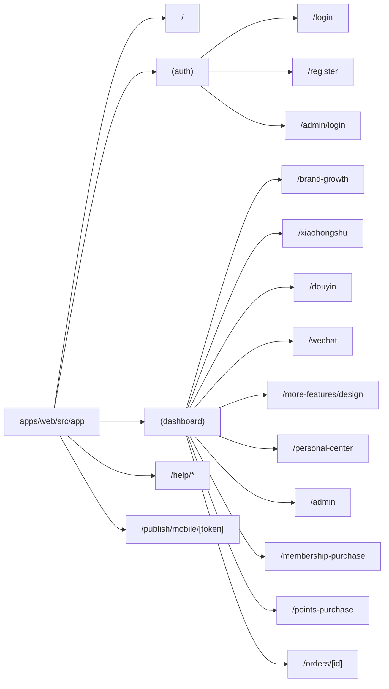
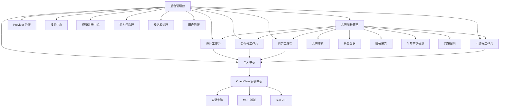
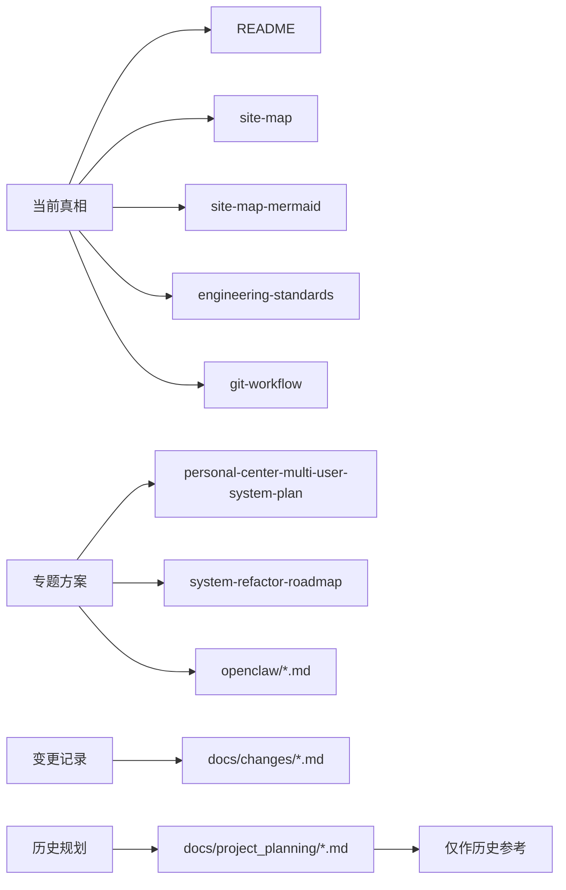

# AI全域运营系统 Mermaid 结构图

## 1. 文档定位

本文件是 `docs/site-map.md` 的可视化补充，只保留当前系统真实在用的结构关系。

## 2. 全站总图

```mermaid
flowchart TD
    A["AI全域运营系统"]

    A --> B["apps/web 前端站点"]
    A --> C["apps/server 后端 API"]
    A --> D["packages/* 共享能力"]
    A --> E["docs 当前文档体系"]

    B --> B1["官网首页 /"]
    B --> B2["认证页 /login /register /admin/login"]
    B --> B3["品牌增长 /brand-growth"]
    B --> B4["小红书 /xiaohongshu"]
    B --> B5["抖音 /douyin"]
    B --> B6["公众号 /wechat"]
    B --> B7["设计工作台 /more-features/design"]
    B --> B8["个人中心 /personal-center"]
    B --> B9["后台 /admin"]
    B --> B10["帮助页 /help/*"]

    C --> C1["Auth"]
    C --> C2["Brands"]
    C --> C3["Collectors"]
    C --> C4["Reports"]
    C --> C5["Works"]
    C --> C6["Tasks"]
    C --> C7["Publishing"]
    C --> C8["Media"]
    C --> C9["Orders"]
    C --> C10["ThirdPartyPlatforms"]
    C --> C11["UserSkills"]
    C --> C12["OpenClaw"]
    C --> C13["Feedback"]
    C --> C14["Scheduler"]
    C --> C15["Admin 模块组"]

    D --> D1["packages/config"]
    D --> D2["packages/prompt-runtime"]
    D --> D3["packages/shared"]
    D --> D4["packages/ui"]

    E --> E1["site-map.md"]
    E --> E2["site-map-mermaid.md"]
    E --> E3["engineering-standards.md"]
    E --> E4["changes/*.md"]
    E --> E5["project_planning/ 历史草案"]
```

## 3. 前端路由图

```mermaid
flowchart LR
    Root["apps/web/src/app"]

    Root --> Home["/"]
    Root --> Auth["(auth)"]
    Root --> Dash["(dashboard)"]
    Root --> Help["/help/*"]
    Root --> Publish["/publish/mobile/[token]"]

    Auth --> Login["/login"]
    Auth --> Register["/register"]
    Auth --> AdminLogin["/admin/login"]

    Dash --> BrandGrowth["/brand-growth"]
    Dash --> Xiaohongshu["/xiaohongshu"]
    Dash --> Douyin["/douyin"]
    Dash --> Wechat["/wechat"]
    Dash --> Design["/more-features/design"]
    Dash --> Personal["/personal-center"]
    Dash --> Admin["/admin"]
    Dash --> Membership["/membership-purchase"]
    Dash --> Points["/points-purchase"]
    Dash --> OrderDetail["/orders/[id]"]
```

## 4. 业务工作台关系图

```mermaid
flowchart TD
    A["品牌增长策略"]
    B["小红书工作台"]
    C["抖音工作台"]
    D["公众号工作台"]
    E["设计工作台"]
    F["个人中心"]
    G["后台管理台"]
    H["OpenClaw 安装中心"]

    A --> A1["品牌资料"]
    A --> A2["采集数据"]
    A --> A3["增长报告"]
    A --> A4["半年营销规划"]
    A --> A5["营销日历"]

    A --> B
    A --> C
    A --> D
    A --> E

    B --> F
    C --> F
    D --> F
    E --> F

    G --> G1["Provider 治理"]
    G --> G2["技能中心"]
    G --> G3["模块注册中心"]
    G --> G4["能力包治理"]
    G --> G5["知识库治理"]
    G --> G6["用户管理"]

    G --> A
    G --> B
    G --> C
    G --> D
    G --> E
    G --> F

    F --> H
    H --> H1["安装令牌"]
    H --> H2["MCP 地址"]
    H --> H3["Skill ZIP"]
```

## 5. 后端模块图

```mermaid
flowchart TD
    App["apps/server/src/app.module.ts"]

    App --> Auth["auth"]
    App --> Brands["brands"]
    App --> Collectors["collectors"]
    App --> Reports["reports"]
    App --> Works["works"]
    App --> Tasks["tasks"]
    App --> Publishing["publishing"]
    App --> Media["media"]
    App --> Orders["orders"]
    App --> Platforms["third-party-platforms"]
    App --> Skills["user-skills"]
    App --> OpenClaw["openclaw"]
    App --> Feedback["feedback"]
    App --> Scheduler["scheduler"]
    App --> Admin["admin/*"]

    Admin --> A1["api-providers"]
    Admin --> A2["billing-rules"]
    Admin --> A3["knowledge-bases"]
    Admin --> A4["model-usage"]
    Admin --> A5["module-definitions"]
    Admin --> A6["skill-packages"]
    Admin --> A7["skill-package-modules"]
    Admin --> A8["skill-package-knowledge-spaces"]
    Admin --> A9["skill-package-skills"]
    Admin --> A10["skills-prompts"]
    Admin --> A11["users-admin"]
```

## 6. 当前真相与历史参考的边界

```mermaid
flowchart LR
    A["当前真相"]
    B["专题方案"]
    C["变更记录"]
    D["历史规划"]

    A --> A1["README"]
    A --> A2["site-map"]
    A --> A3["site-map-mermaid"]
    A --> A4["engineering-standards"]
    A --> A5["git-workflow"]

    B --> B1["personal-center-multi-user-system-plan"]
    B --> B2["system-refactor-roadmap"]
    B --> B3["openclaw/*.md"]

    C --> C1["docs/changes/*.md"]

    D --> D1["docs/project_planning/*.md"]
    D1 --> D2["仅作历史参考"]
```
